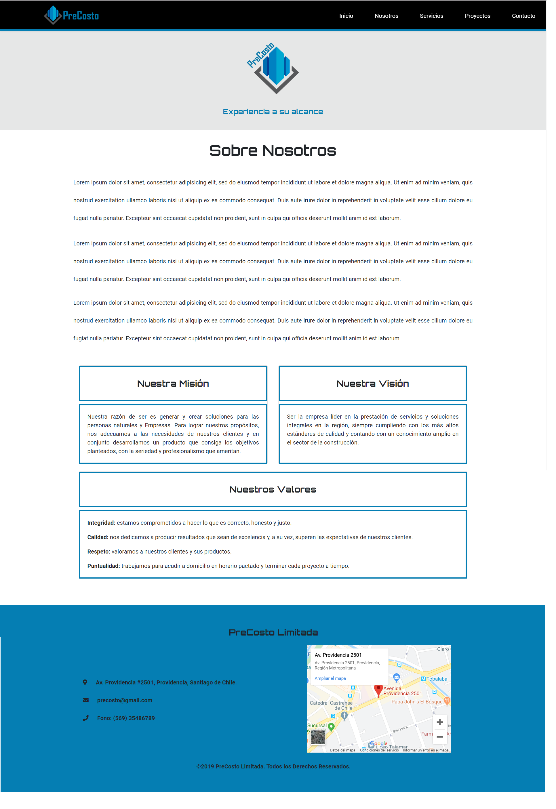
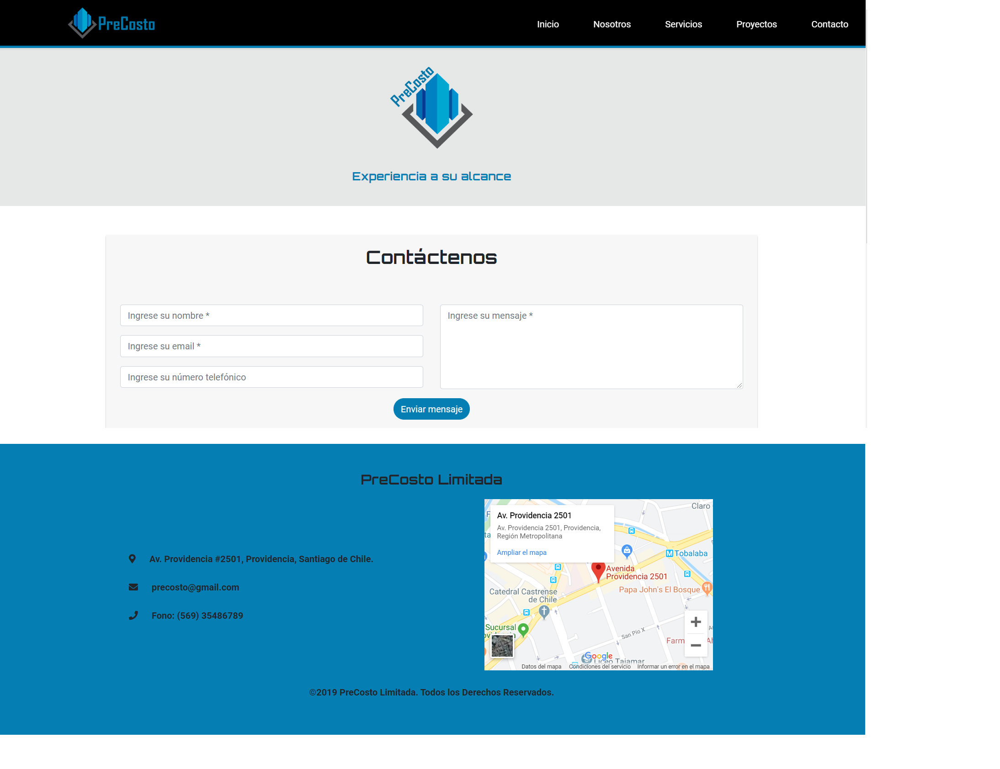
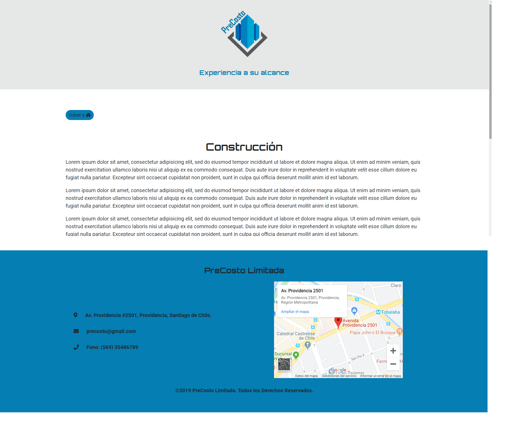
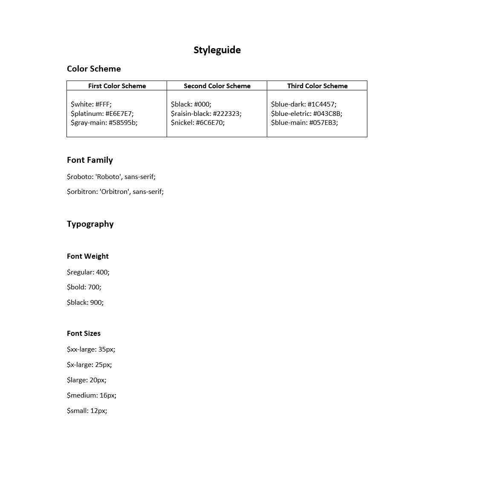

# Proyecto Sitio Web

- Proyecto Precosto

- Proyecto generado para un tercero

- Página web enfocada en el rubro de la construcción que busca ampliar cartera de clientes objetivos. 		

- Estrategia:
	- Los usuarios serán personas naturales y jurídicas que requieran construcción, remodelación, mantención o estructuras metálicas hasta mediana complejidad.
	- La conversión de éstos será contactar a la empresa a través de un formulario para solicitar presupuesto.

- Wireframe:
	- Vista página principal:

	

	- Vista página nosotros:

	

	- Vista página proyectos:

	

	- Vista página contacto:

	

	- Vista página single (servicios):

	

- Guía de estilo:

